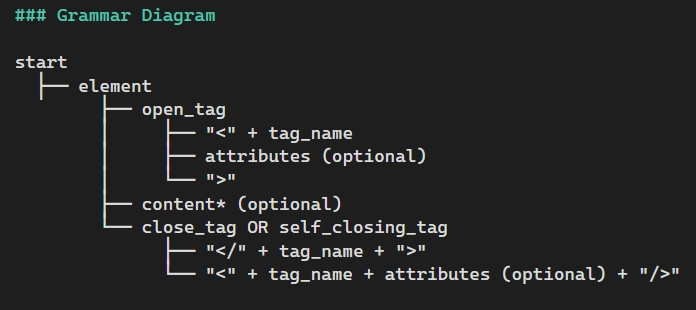

# XML Language Tag Parser 

- **Link:** (https://crates.io/crates/xml_language_tag_parser)
- **Docs:** (https://docs.rs/xml_language_tag_parser/0.1.4/xml_language_tag_parser/)


## Brief Description
The **XML Language Tag Parser** is a Rust-based parser designed to handle and parse XML documents with specific focus on extracting language tags, elements, attributes, and content. This parser is intended to facilitate processing XML documents in applications where structured content needs to be validated and manipulated. The parsed structure includes elements, attributes, and content, allowing for further use in applications that require such data in a structured format.

### How the Parsing Works

The parsing process involves using the `pest` library to define grammar rules for XML-like tags. These grammar rules are as follows:

1. **Parsing the XML document**: The input XML string is parsed using `pest` parser library. It begins by breaking the document into tokens, which are then matched against predefined grammar rules.
2. **Element parsing**: Each XML element (e.g., `<div>`, `<p>`) is identified. The parser extracts its tag name and attributes.
3. **Attribute handling**: The parser identifies the attributes within each element, ensuring they follow the correct format (e.g., `id="123"`).
4. **Content handling**: The parser processes both text content and nested elements.
5. **Error Handling**: If the XML is malformed or contains any issues (like missing closing tags or invalid attributes), the parser raises appropriate errors for correction.

### Grammar Diagram




### Grammar Rules

1. **Element Rule**: an element consists of an opening tag (`open_tag`), content (`content`), and a closing tag (`close_tag`).
2. **Open Tag Rule**: the `open_tag` starts with a `<`, followed by a `tag_name` (the name of the element), optional attributes (if any), and ends with a `>`.
3. **Close Tag Rule**: the `close_tag` starts with `</`, followed by a `tag_name`, and ends with a `>`.
4. **Self-Closing Tag Rule**: a self-closing tag is an element that doesn't require a separate closing tag. It ends with `/>`.
5. **Tag Name Rule**: the tag name must start with an alphabetic character and may include alphanumeric characters, hyphens (`-`), or underscores (`_`).
6. **Attributes Rules**: attributes are key-value pairs within the opening tag. Multiple attributes can be present, separated by whitespace. An attribute consists of a name, an equals sign (`=`), and a value enclosed in double quotes.
7. **Attribute Name Rule**: the attribute name can contain alphanumeric characters, hyphens (`-`), underscores (`_`), or colons (`:`).
8. **Attribute Value Rule**: the attribute value consists of any characters except for the double quote (`"`).
9. **Content Rule**: the `content` rule defines what can appear inside an element. It can be a mixture of other elements and text.
10. **Text Rule**: text is the content inside an element that is not a tag. It can include any characters except for `<` and `>`.

### Example: Parsing a Simple XML with Attributes

For the input:
```
cargo run "<person id=\"1\" age=\"30\"><name>John Doe</name></person>"
Parsed XML Structure:
Element {
    tag_name: "person",
    attributes: [
        Attribute {
            name: "id",
            value: "1",
        },
        Attribute {
            name: "age",
            value: "30",
        },
    ],
    content: [
        Element {
            tag_name: "name",
            attributes: [],
            content: [],
            text: Some(
                "John Doe",
            ),
        },
    ],
    text: None,
}
